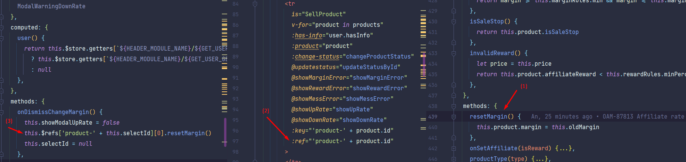

### Question:
How to call function in child component from parent components?

### Solution:

1/ Child component: Write a function

2/ Parent: Create a ref

3/ Parent: Call child function via ref

### Sample:

