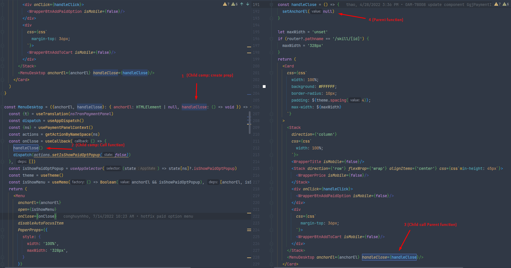
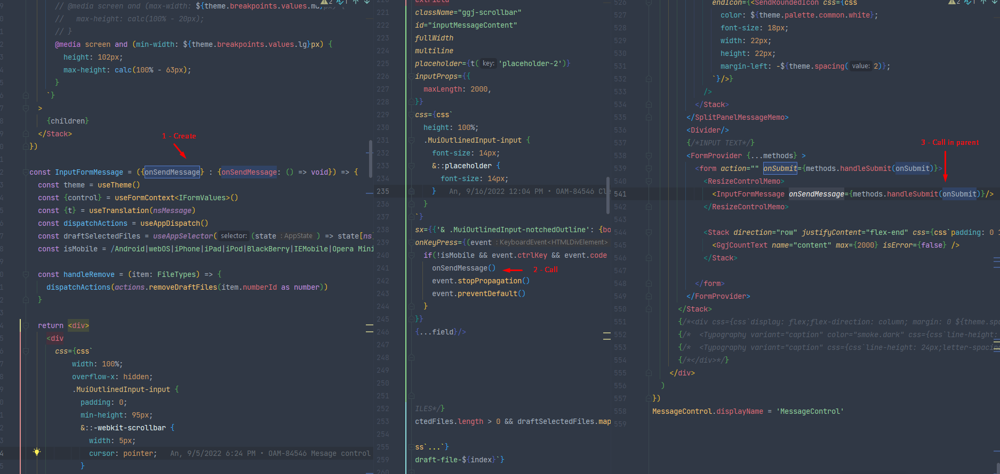

### Question:
How to call function in parent component from child components?

### Solution:

1/ Child component: Write a function

2/ Child component: Call function

3/ Parent: Function was called from child component

### Sample:
#### sample 1

#### sample 2
